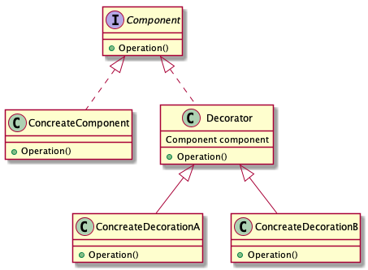

***************
装饰者模式
***************

装饰者模式通过组合的方式动态地扩展对象的功能，提供了一种有别于继承的另一种选择。

组合
=====

Go的语法非常简洁，以至于在Go中不存在"继承"这一概念，所有对对象功能的扩展都是靠组合来完成的：

::

    type WrapperDB struc{
        db *leveldb.DB
        ...
    }

在上面的代码中，``WrapperDB`` 是我们基于LevelDB对象包装的一个新的DB对象，当我们获得一个实例
``wdb`` 时就可以使用 ``wdb.db.Xx()`` 来调用LevelDB相关功能了。

.. note::

    你也可以通过 **匿名组合** 的方式直接使用 ``wdb.Xx()`` 调用LevelDB功能。

结构
=====

装饰者模式的代码结构如下图所示：

图中涉及的几个对象的含义如下：

* ``Component``: 被装饰对象的抽象接口
* ``ConcreateComponent``：被装饰对象的具体实现
* ``Decorator``：装饰者
* ``ConcreateDecoratorA``：装饰者实现A
* ``ConcreateDecoratorA``：装饰者实现B

目前为止，你可能对装饰者毫无概念，没关系，接下来我将用实际的例子来帮助你了解装饰者的用法，不过在此之前我需要你把上面这张图描述的的关系先记住了，这有助于你快速了解例子中的代码。

例子：奶茶
==========

程序员Bob打算创业开一家奶茶店，为此他自己写了一个奶茶订单系统。主要的功能是为不同的奶茶结算出不同的价格。

奶茶有不同的类型，并且每种奶茶都可以附加一些小作料，例如：珍珠、布丁、红豆等等。每位顾客可以选择一种类型的奶茶并添加任意的作料，例如：红豆布丁奶茶！

实现：第一版
============
很快，Bob就实现了一个版本：

::

    type MiklTea interface{
        description() string
        cost() float64
    }